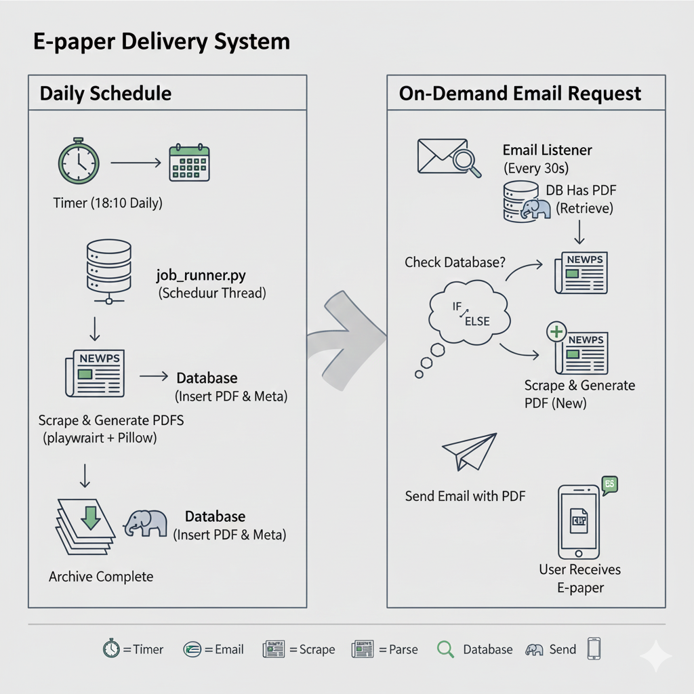
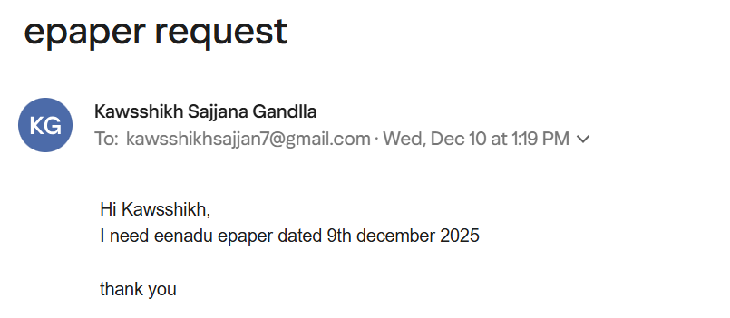
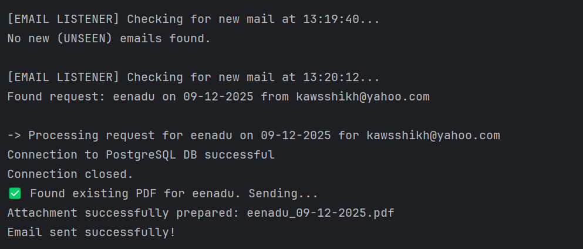
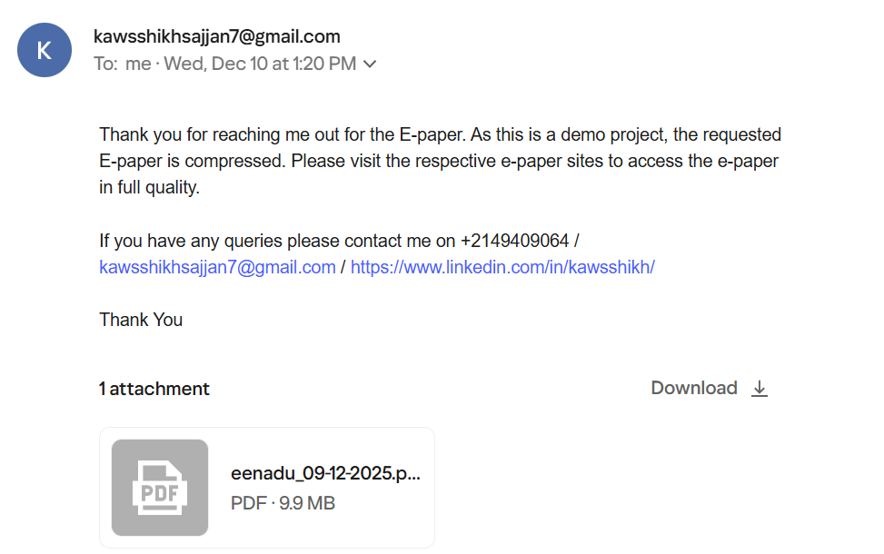

# E-paper Delivery System
> This is an automated delivery system that utilizes **concurrent threading** to manage scheduled 
> newspaper archival and on-demand email requests. It employs **Playwright** for web scraping, **PostgreSQL** 
> for data archival, and **Python's email libraries** to process user requests (e.g., "eenadu 09-12-2025") and deliver 
> the resulting PDF file via SMTP.

## Workflow
Workflow of the project created by Nanobanana


## Features

The E-paper Delivery System is a robust, modular Python application designed for the automated acquisition, archival, and delivery of daily newspapers : Eenadu, Sakshi & Andhrajyothy

It operates using **concurrent threading** (`job_runner.py`) to manage two main, independent services for high availability and responsiveness:

### 1. Daily Scheduler Thread (Proactive)

This service runs at a scheduled time (e.g., 18:10 daily) to perform bulk processing:
* Automatically scrapes and processes the latest Newspapers from respective newspapers.
* Generates a single, compressed PDF for each newspaper.
* Archives the PDF metadata (name, date, file path) in a **PostgreSQL** database.

### 2. Email Listener Thread (Reactive)

This service continuously polls the dedicated inbox for user requests:
* Parses incoming emails for the requested newspaper name and date.
* **Intelligent Lookup:** It first checks the PostgreSQL database for the requested PDF.
* **If Found:** Delivers the archived file instantly via email (`send_email.py`).
* **If Not Found:** Triggers a real-time scrape and PDF generation on-demand before delivery and archival.

This system ensures efficient delivery of digital papers while maximizing resource efficiency by leveraging the database to prevent redundant scraping and generation. All sensitive credentials (Email, DB) are securely handled through the `.env` configuration file.

## Project Structure

```
epaper-project/ 
├── core/ 
│ ├── scraper.py # Playwright integration for fetching page content and image URLs. 
│ └── pdf_generator.py # Downloads images, merges layers (JPG+PNG), compresses, and creates the final PDF. 
├── email_handler/ 
│ ├── read_emails.py # Connects to IMAP to poll and read new user requests. 
│ └── send_email.py # Connects to SMTP to send the PDF attachment. 
├── db/ 
│ └── postgres_curd.py # Handles database connection and CRUD operations (Insert/Get) for epaper metadata. 
├── config/ 
│ └── config.py # Configuration manager; securely loads all settings and credentials from .env. 
├── scheduler/ 
│ └── job_runner.py # The main application orchestrator, manages the two concurrent threads (Email Listener & Daily Scraper). 
├── newspapers/
│ ├── eenadu/
│ ├── sakshi/
│ └── andhrajyothy/ # Directory where generated PDFs are stored.
├── main.py # Entry point for the application. 
├── .env # Sensitive file: Stores all email and DB credentials (not commited). 
└── .gitignore # Ensures environment files (venv/) and sensitive configuration (.env) are not committed.
```
## Prerequisites
* Python 3.8+
* PostgreSQL database
* Email account with IMAP/SMTP access
* Playwright browsers installed

## Installation

### 1. Clone the Repository
```bash 
git clone https://github.com/kawsshikh/epaper_delivery_system
cd epaper_delivery_system
```

### 2. Create Virtual Environment
```bash
# For Linux/Mac
python3 -m venv venv
source venv/bin/activate

# For Windows
python -m venv venv
venv\Scripts\activate

```
### 3. Install Dependencies
```bash

pip install -r requirements.txt
```

### 4. Install Playwright Browsers
```bash
# To install all avaliable browsers
playwright install

# to install only chromium
playwright install chromium
```

### 5. Set Up PostgreSQL Database
```bash
-- Connect to PostgreSQL
sudo -u postgres psql

-- Create database
CREATE DATABASE epaper_db;
```

### 6. Configure Environment Variables
#### Create a *.env* file in the project root:
```bash

# Database Configuration
DB_HOST=localhost
DB_PORT=5432
DB_NAME=epaper_db
DB_USER=your_username
DB_PASSWORD=your_password

# Email Configuration
IMAP_SERVER=imap.gmail.com
SMTP_SERVER=smtp.gmail.com
SMTP_PORT=587
EMAIL_ADDRESS=your_email@gmail.com
APP_PASSWORD=your_app_password
```
### 7. Run The application
```bash
python main.py
```

## User Guide

### How to Request E-papers
To request an e-paper, end user simply has to send an email to the email_id configured with the following format:

### Email Format Requirements 

| Component  |           Requirement           |                                     Example                                      |
|:----------:|:-------------------------------:|:--------------------------------------------------------------------------------:|
|     To     |        Email_id on file         |                            kawsshikhsajjan7@gmail.com                            |
|  Subject   | Must contain the word "epaper"  |       epaper Request, Daily Epaper, Need ePaper                       |
|    Body    | Specify newspaper name and date |                                eenadu 05-12-2025                                 

### supported Newspapers:
```text
- eenadu
- sakshi
- andhrajyothy
```
### supported Date formats:
| Supported Format |         Example         |
|:----------------:|:-----------------------:|
|    DD-MM-YYYY    | 15-12-2024, 05-02-2024  |
|    DD/MM/YYYY    |  15/12/2024, 5/2/2024   |
|    DD.MM.YYYY    |  15.12.2024, 5.2.2024   |
|    MM-DD-YYYY    | 12-15-2024 (US format)  |
|    MM/DD/YYYY    |       12/15/2024        |
|    YYYY-MM-DD    | 2024-12-15 (ISO format) |
|    YYYY/MM/DD    |       2024/12/15        |
|    YYYY.MM.DD    |       2024.12.15        |
|      D-M-YY      |    5-2-24, 15-12-24     |
|      D/M/YY      |    5/2/24, 15/12/24     |
| Day Month Year   |   15 December 2025     |

## Demo

Here is the workflow in action:

### 1. Requesting an E-paper
User sends an email with the subject "epaper" and body containing the newspaper name and date.


### 2. System Processing
The system picks up the email, parses it, and generates/fetches the PDF.


### 3. Delivery
The requested E-paper is delivered to the user's inbox.



## Configuration

You can customize the scheduling time and polling interval in `scheduler/job_runner.py`.

* **Scheduled Time**: Default is `18:10`. To change, update:
  ```python
  schedule_time = "18:10" # <Your Preferred Time>
  ```
* **Polling Interval**: Default is `30` seconds. To change, update:
  ```python
  POLLING_INTERVAL = 30 # <Your Interval in Seconds>
  ```

## Troubleshooting

### Common Issues

1. **Email Auth Failed**
   - Ensure `APP_PASSWORD` is generated correctly from your Google Account settings (if using Gmail).
   - Check if IMAP is enabled in your email settings.
   - *<Add specific error messages or solutions here>*

2. **Database Connection Refused**
   - Verify PostgreSQL service is running.
   - Check `DB_PORT` and credentials in `.env`.
   - *<Add specific DB troubleshooting steps here>*

3. **Playwright Browser Not Found**
   - Run `playwright install` again.
   - Ensure the correct OS dependencies are installed.

## Future Improvements / To-Do
- [ ] Support for more newspapers.
- [ ] Add support for "All" newspapers in email request.
- [ ] Add Subscribe option to get the newspapers everyday
- [ ] Implement file.io API to send files beyond 25MB

